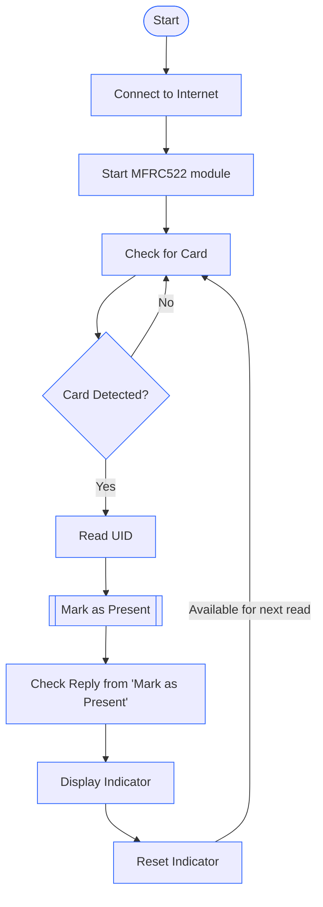
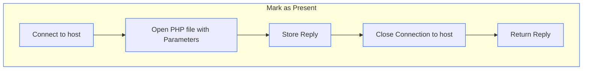
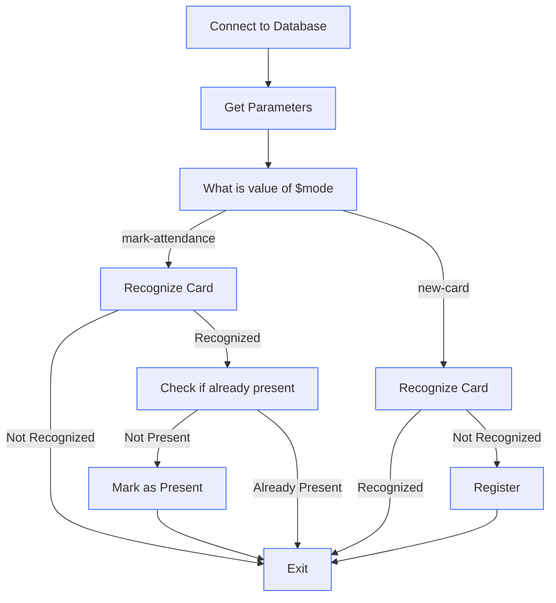

# NodeMCU based Attendance System

## Arduino Program

```mermaid
flowchart TD
    A(["Start"]) --> B["Connect to Internet"]
    B --> C["Start MFRC522 module"]
    C --> D["Check for Card"]
    D --> E{"Card Detected?"}
    E -- Yes --> F["Read UID"]
    E -- No --> D
    F --> G[["Mark as Present"]]
    G --> H["Check Reply from 'Mark as Present'"]
    H --> I["Display Indicator"]
    I --> J["Reset Indicator"]
    J -- Available for next read --> D
    style A stroke:#2962FF
    style B stroke:#2962FF
    style C stroke:#2962FF
    style D stroke:#2962FF
    style E stroke:#2962FF
    style F stroke:#2962FF
    style G stroke:#2962FF
    style H stroke:#2962FF
    style I stroke:#2962FF
    style J stroke:#2962FF
```

```mermaid
flowchart TD
 subgraph A["Mark as Present"]
        B["Connect to host"]
        C["Open PHP file with Parameters"]
        D["Store Reply"]
        E["Close Connection to host"]
        F["Return Reply"]
  end
    B --> C
    C --> D
    D --> E
    E --> F
    style A stroke:#2962FF
    style B stroke:#2962FF
    style C stroke:#2962FF
    style D stroke:#2962FF
    style E stroke:#2962FF
    style F stroke:#2962FF
```

## PHP / Server Side Code

```mermaid
flowchart TD
    A["Connect to Database"] --> B["Get Parameters"]
    B --> C["What is value of $mode"]
    C -- mark-attendance --> D["Recognize Card"]
    C -- new-card --> G["Recognize Card"]
    G -- Recognized --> Z["Exit"]
    D -- Not Recognized --> Z
    G -- Not Recognized --> H["Register"]
    D -- Recognized --> E["Check if already present"]
    E -- Not Present --> F["Mark as Present"]
    E -- Already Present --> Z
    H --> Z
    F --> Z
    style A stroke:#2962FF
    style B stroke:#2962FF
    style C stroke:#2962FF
    style D stroke:#2962FF
    style E stroke:#2962FF
    style F stroke:#2962FF
    style G stroke:#2962FF
    style H stroke:#2962FF
    style Z stroke:#2962FF
```
